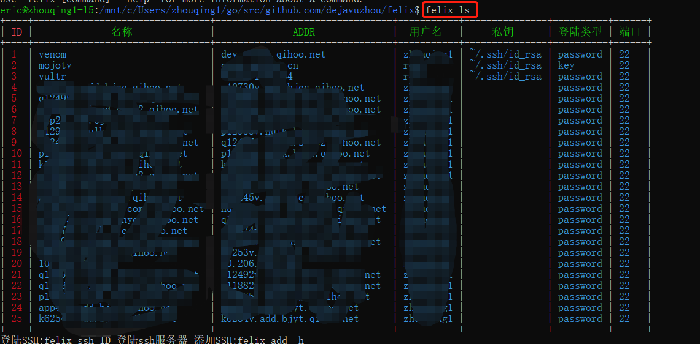
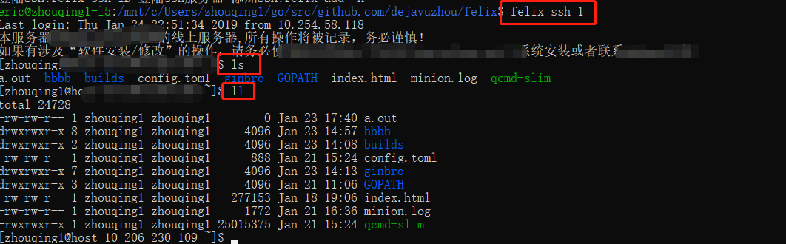
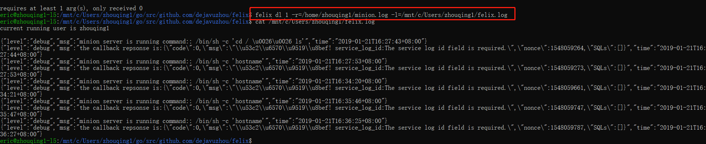
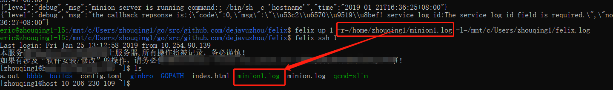
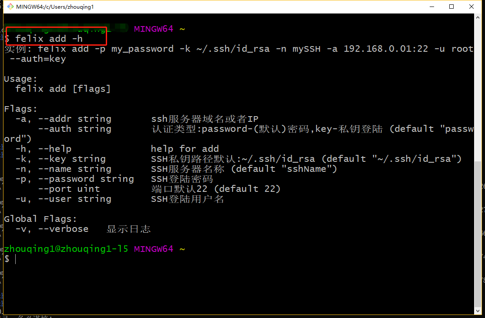
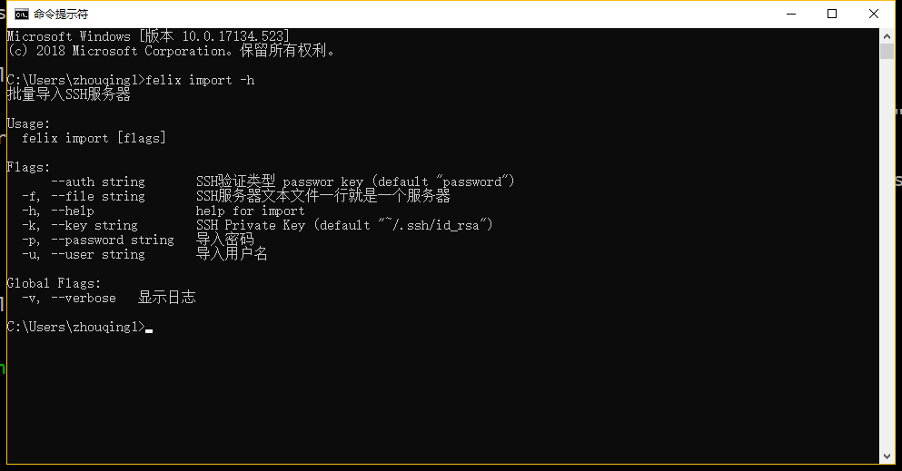
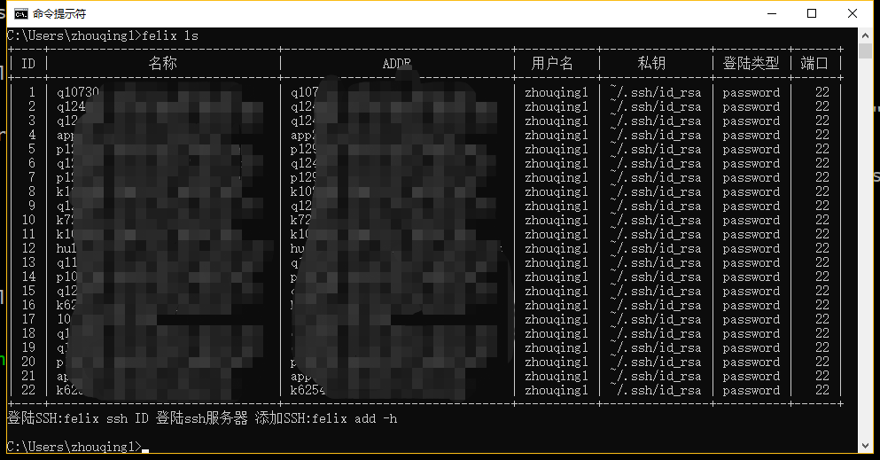

# felix
[](https://travis-ci.org/dejavuzhou/felix)

## 解决痛点
- 有一大堆服务器需要管理
- 有服务器设置的密码台复杂记不住
- 解决sudo输入密码的问题

## Feature

- 纯go语言编写安装简单
- 遇到sudo时候自动帮助你输入sudo的密码(解决粘贴密码的疼苦)
- 快捷scp/sftp 上传下载文件或者目录
- 批量导入SSH服务器
- 支持windows,linux,mac多平台

## 安装
### 编译安装(拥有GO语言环境)
```bash
mkdir -p $GOPATH/src/golang.org/x && cd $GOPATH/src/golang.org/x 
git clone https://github.com/golang/sys.git
git clone https://github.com/golang/crypto.git
echo "上面代码为了解决go get golang.org失败,使用github.com镜像获取依赖包."

go get github.com/dejavuzhou/felix || sudo go get github.com/dejavuzhou/felix
```
导出GOIB到PATH
在你的`~/.profile` or `~/.bashrc` 中增加 `export PATH=$PATH:$GOPATH:$GOBIN` 

成功: `felix -h` 或者 `cd $GOPATH/src/github.com/dejavuzhou/felix;  go build;   ./felix -h;`

### 二进制下载安装
//TODO ...
## Usage

```bash
Usage:
  felix [flags]
  felix [command]

Available Commands:
  add          添加SSH服务器
  del          删除SSH服务器
  dl           从SSH服务器上下载文件
  import       批量导入SSH服务器
  ls           查看全部的SSH服务器
  reset        清空SSH服务器全部记录
  ssh          登陆SSH服务
  up           上传本地文件/目录到SSH服务器
  update       更新SSH服务器信息
  help         Help about any command

Flags:
  -h, --help      help for felix
  -v, --verbose   显示日志

Use "felix [command] --help" for more information about a command.
```

### 1. `felix ls` 查看全部服务器


### 2. `felix ssh ID` SSH登陆


### 3. `felix dl ID -r=/remotePath -l=/localPath` scp 下载文件


### 4. `felix up ID -r=/remotePath -l=/localPath` scp 上传文件


### 5. `felix -h` 查看帮助,或者 `felix COMMAND -h` 查看每个命令的说明







## 已知BUG
- [ ]windows 平台vim 窗口size问题,`signal.Notify(sigwinchCh, syscall.SIGWINCH)` `fd`获取不到
