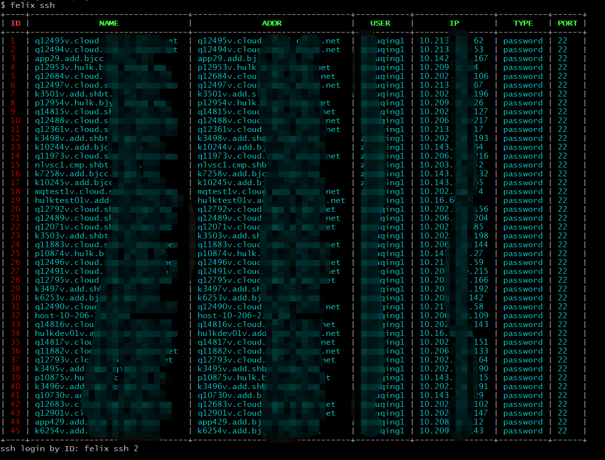

# Felix
[](https://travis-ci.org/dejavuzhou/felix)

## For Who

- BackEnd Engineer
- Golang SQL RESTful APIs engineer
- DevOps Engineer
- People Heavily engage with SSH

## Do What

- manage massive SSH login configuration
- ssh login speedily
- generate a RESTful app from SQL database with [gin-gonic/gin](https://github.com/gin-gonic/gin) and [GORM](https://github.com/jinzhu/gorm) in GO
- start TCP and SOCK proxy with ssh with speedily
- terminal task list
- Pewdiepie's brofit command to subscribe the Youtube channel

## Overview
commands:

```bash
$ felix

Usage:
  felix [command]

Available Commands:
  brofist     Pewdiepie needs your help.Do your part to subscribe Pewdiepie's Yo                                                                                                              utube Channel.
  clean       purge all felix configuration
  ginbro      generate a RESTful code project from SQL database
  goDoc       golang.google.cn/pkg
  help        Help about any command
  json        open a tab in browser to convert json to golang struct
  ssh         open a ssh terminal
  sshadd      add a ssh connection
  sshdl       scp download file or folder
  sshdu       duplicate a ssh connection
  sshedit     update a ssh connection config
  sshexport   export all ssh connection info to a csv file
  sshimport   import massive ssh server info from a csv file
  sshinfo     view a ssh info
  sshls       list all ssh info or search by hostname
  sshproxy    ssh port proxy
  sshrm       delete a ssh info
  sshsocks    start a socks4/5 proxy
  sshup       scp upload
  task        show all TODO tasks
  taskad      add a task
  taskok      set a task done
  taskrm      remove a task

Flags:
  -h, --help      help for felix
      --verbose   verbose

Use "felix [command] --help" for more information about a command.

```


## Build and Run

- `go get github.com/dejavuzhou/felix`
- `go install`
- append $GOBIN into your env $PATH
- `felix -h` 

or just `go build` run binary by `./felix`


## ScreenShot

### command: `felix ginbro`

`felix ginbro` command is migrated from [dejavuzhou/ginbro](https://github.com/dejavuzhou/ginbro).
[Generated WordPress MySQL database running demo](http://ginbro.mojotv.cn/swagger/)

[Generated code base](https://github.com/dejavuzhou/ginbro-son)

```bash
$ felix ginbro
Error: required flag(s) "appDir", "dbAddr" not set
Usage:
  felix ginbro [flags]

Examples:
felix rest -u root -p password -a "127.0.0.1:3306" -d dbname -c utf8 --authTable=users --authColumn=pw_column -o=FelixRestOut"

Flags:
  -o, --appDir string       app's code output directory
  -l, --appListen string    app's listening addr (default "127.0.0.1:5555")
      --authColumn string   bcrypt password column (default "password")
      --authTable string    login user table (default "users")
  -a, --dbAddr string       datatbase connection addr (default "127.0.0.1:3306")
  -c, --dbCharset string    database charset (default "utf8")
  -n, --dbName string       database name
  -p, --dbPassword string   database user password (default "password")
  -t, --dbType string       database type: mysql/postgres/mssql/sqlite (default "mysql")
  -u, --dbUser string       database username (default "root")
  -h, --help                help for ginbro

Global Flags:
      --verbose   verbose

required flag(s) "appDir", "dbAddr" not set
```

### command: `felix sshls`



### command: `felix ssh 2`


### command: `felix sshsocks 34 -l 1080`


### command: `felix taskad`


## Code Detail

- save SSH configurations into a SQLite.db in $HOME/.felix
- use [spf13/cobra](https://github.com/spf13/cobra#getting-started) as command framework

### `felix ginbro` detail
- 1. use SQL query get all tables and column schema from database
- 2. transform SQL type into Goalng type and [Swagger Doc](https://swagger.io/) type
- 3. use [Golang Std Lib(text/template)](https://golang.org/pkg/text/template/) to output [Gin's handler and Route files](https://github.com/gin-gonic/gin) and [GORM model files](https://github.com/jinzhu/gorm)
- 4. `os.exec` call `go fmt` to format the output codebase

### `felix sshls` detail
- 1. use [GORM](https://github.com/jinzhu/gorm) retrieve all SSH configuration from SQLite.db
- 2. use [olekukonko/tablewriter](https://github.com/olekukonko/tablewriter) write table into terminal

### `felix ssh 9`
- 1. get a ssh configuration by ID
- 2. use [golang.org/x/crypto/ssh](https://golang.org/x/crypto/ssh) package start ssh session
- 3. customize `stdin` and `stdout` to listen Sudo command for password message then input sudo password automatically