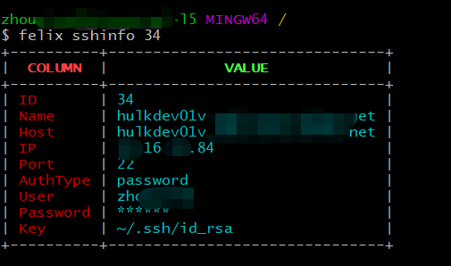

# Felix
[](https://travis-ci.org/dejavuzhou/felix)

## 给谁用?

- 后端工程师
- Golang RESTful APIs with SQL 工程师
- 运维(开发工程师)
- 工作中频繁使用SSH和不停的输入sudo命令的工程师

## 能做什么?

- 管理大量SSH连接配置
- 快速的使用SSH登陆功能和再应用层免去输入sudo密码
- 快速的更具SQL数据库表结构生成RESTfual Golang APIs 代码 [gin-gonic/gin](https://github.com/gin-gonic/gin) and [GORM](https://github.com/jinzhu/gorm) in GO
- 利用SSH快速的开启TCP和SOCKS5/4 代理
- 建议的命令行TODO-LIST
- Pewdiepie's brofit command to subscribe the Youtube channel

## Overview
提供的命令:

```bash
$ felix -h
Usage:
  felix [command]

Available Commands:
  brofist     Pewdiepie needs your help.Do your part to subscribe Pewdiepie's Yo                                                      utube Channel.
  clean       purge all felix configuration
  ginbro      generate a RESTful code project from SQL database
  goDoc       golang.google.cn/pkg
  help        Help about any command
  json        open a tab in browser to convert json to golang struct
  scpd        scp download file or folder
  scpu        scp upload a file or a folder
  ssh         open a ssh terminal
  sshadd      add a ssh connection configuration
  sshdu       duplicate a ssh connection
  sshedit     update a ssh connection
  sshexport   export all ssh connection configuration to a csv file
  sshimport   import massive ssh connection configuration from a csv file
  sshinfo     view a ssh connection
  sshls       list all ssh connection configuration or search by hostname
  sshproxy    ssh port proxy
  sshrm       delete a ssh connection
  sshsocks    start a socks4/5 proxy
  task        list all rows in TaskList
  taskad      add a row into TaskList
  taskok      set a row done in TaskList
  taskrm      remove a row in TaskList

Flags:
  -h, --help      help for felix
      --verbose   verbose
  -V, --version show binary build informantion
```


## 编译和运行

- `go get github.com/dejavuzhou/felix`
- `go install`
- [把 $GOBIN 添加到 $PATH](https://stackoverflow.com/questions/25216765/gobin-not-set-cannot-run-go-install)
- `felix -h` 

or just `go build` run binary by `./felix`


## 功能截图

### `felix ginbro` 快速的更具SQL(支持 MySql/SQLite/PostgreSQL)数据库生成

`felix ginbro` command 功能迁移自 [dejavuzhou/ginbro](https://github.com/dejavuzhou/ginbro).项目
[生成的wordpress项目golang RESTful APIs](http://ginbro.mojotv.cn/swagger/)

[wordpress RESTful Golang Demo代码预览 ](https://github.com/dejavuzhou/ginbro-son)

```bash
$ felix ginbro
Error: required flag(s) "appDir", "dbAddr" not set
Usage:
  felix ginbro [flags]
Examples:
felix rest -u root -p password -a "127.0.0.1:3306" -d dbname -c utf8 --authTable=users --authColumn=pw_column -o=FelixRestOut"

Flags:
  -o, --appDir string       app's code output directory
  -l, --appListen string    app's listening addr (default "127.0.0.1:5555")
      --authColumn string   bcrypt password column (default "password")
      --authTable string    login user table (default "users")
  -a, --dbAddr string       datatbase connection addr (default "127.0.0.1:3306")
  -c, --dbCharset string    database charset (default "utf8")
  -n, --dbName string       database name
  -p, --dbPassword string   database user password (default "password")
  -t, --dbType string       database type: mysql/postgres/mssql/sqlite (default "mysql")
  -u, --dbUser string       database username (default "root")
  -h, --help                help for ginbro

Global Flags:
      --verbose   verbose

required flag(s) "appDir", "dbAddr" not set
```
#### the output code base


### command: `felix sshls`


### command: `felix ssh 3`



### command: `felix ssh 2`


### command: `felix sshsocks 34 -l 1080`


### command: `felix taskad`


## 代码架构逻辑

- 保存SSH连接配置信息到SQLite.db in `$HOME/.felix.db`
- 使用 [spf13/cobra](https://github.com/spf13/cobra#getting-started) 作为命令行框架

### `felix ginbro` 架构逻辑
1. 使用SQL命令获取全部表的结构和字段从数据库中
2. 转换 SQL 类型到 [Swagger Doc](https://swagger.io/) 类型和生成每张表的`gorm.Model`的结构体
3. 使用标准库 [Golang Std Lib(text/template)](https://golang.org/pkg/text/template/) 生成 [Gin's handler and Route](https://github.com/gin-gonic/gin) 文件 和 [GORM model](https://github.com/jinzhu/gorm) 文件
4. `os.exec` 执行 `go fmt` 安装golang规范格式化代码仓库

### `felix sshls` Logic
1. 使用 [GORM](https://github.com/jinzhu/gorm) 从SQLite.db获取全部的ssh连接信息
2. 使用 [olekukonko/tablewriter](https://github.com/olekukonko/tablewriter) 输出表格到命令行

### `felix ssh 9` Logic
1. 更具ID从书库中获取一行SSH连接配置
2. 使用 [golang.org/x/crypto/ssh](https://golang.org/x/crypto/ssh)包开启一个ssh session
3. 自定义 `stdin` and `stdout` 监听sudo命令行提示输入密码信息.自动输入sudo密码.